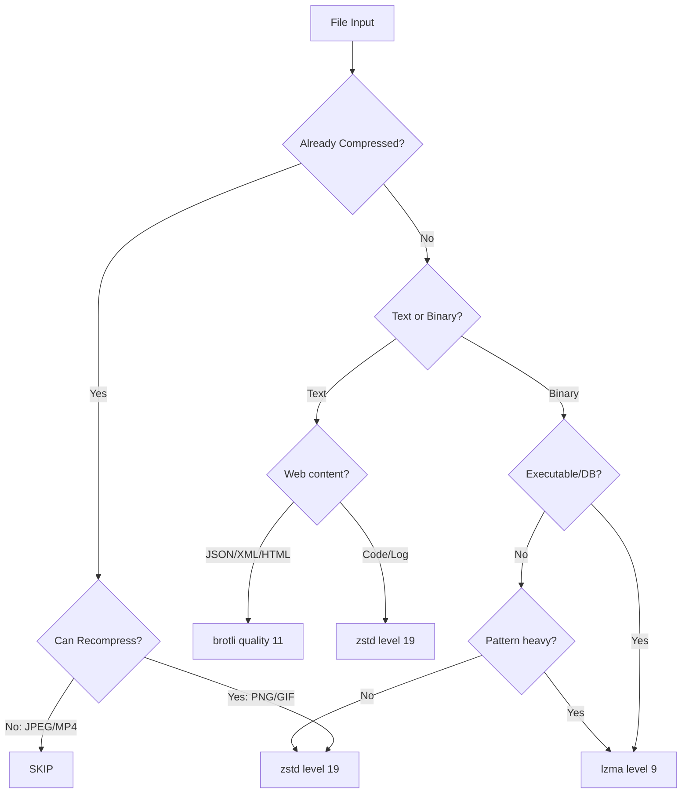

# Algorithm Comparison Matrix

**Summary**: Tabella comparativa completa degli algoritmi supportati.

**Last updated**: 2026-04-22

---

## Quick Reference

| | zstd | lzma/xz | brotli | zpaq* |
|---|------|---------|--------|-------|
| **Ratio (text)** | 3.5-4.2x | 3.0-3.8x | 4.0-4.5x | 5.0-7.0x |
| **Ratio (binary)** | 1.8-2.2x | 2.5-2.8x | 1.5-1.8x | 3.0-4.0x |
| **Encode Speed** | ⚡⚡⚡⚡ | ⚡⚡ | ⚡⚡ | ⚡ |
| **Decode Speed** | ⚡⚡⚡⚡ | ⚡⚡⚡ | ⚡⚡⚡⚡ | ⚡ |
| **Memory** | Low | Medium | Low | High |
| **Streaming** | ✅ | ✅ | ✅ | ❌ |
| **Levels** | 1-22 | 0-9 | 0-11 | 1-5 |

*zpaq non ancora implementato, pianificato per il futuro.

---

## Best Use Cases

### zstd
```
✅ Codice sorgente
✅ Dati strutturati generici
✅ Archivi misti
✅ Streaming real-time
✅ Default quando unsure
```

### lzma/xz
```
✅ Binary executables
✅ Database files
✅ Log strutturati
✅ Dati scientifici
✅ Cold storage binari
```

### brotli
```
✅ JSON/XML
✅ HTML/CSS/JS
✅ Markdown
✅ Config files
✅ Web assets
```

---

## Benchmark Summary

### Text Corpus (codice, JSON, log)

```
File Types: .cpp, .py, .js, .json, .xml, .md
Total Size: ~50 MB

| Algorithm | Compressed | Ratio | Time |
|-----------|------------|-------|------|
| zstd-19   | 4.8 MB     | 10.4x | 2.1s |
| zstd-22   | 4.2 MB     | 11.9x | 8.3s |
| lzma-9    | 5.1 MB     | 9.8x  | 45s  |
| brotli-11 | 3.9 MB     | 12.8x | 62s  |
```

### Binary Corpus (exe, db, data)

```
File Types: .exe, .dll, .db, .bin
Total Size: ~100 MB

| Algorithm | Compressed | Ratio | Time |
|-----------|------------|-------|------|
| zstd-19   | 48 MB      | 2.1x  | 4.2s |
| zstd-22   | 44 MB      | 2.3x  | 15s  |
| lzma-9    | 36 MB      | 2.8x  | 180s |
| brotli-11 | 52 MB      | 1.9x  | 85s  |
```

---

## Decision Flowchart



---

## Related Pages

- [[zstd]] — Deep dive
- [[lzma-xz]] — Deep dive
- [[brotli]] — Deep dive
- [[decisions/file-type-to-algorithm]] — Mappatura FileType → Engine