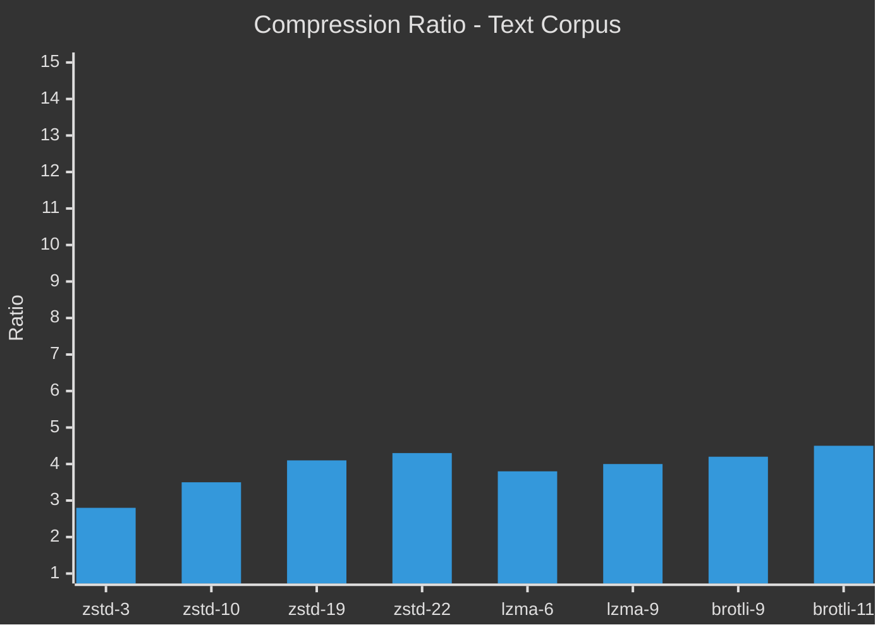
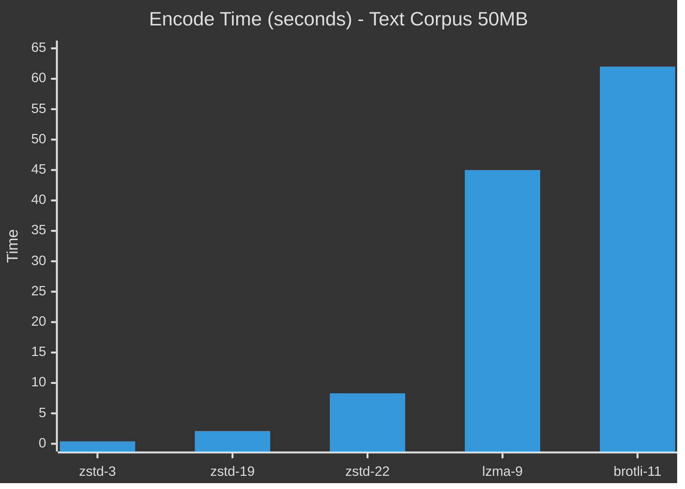
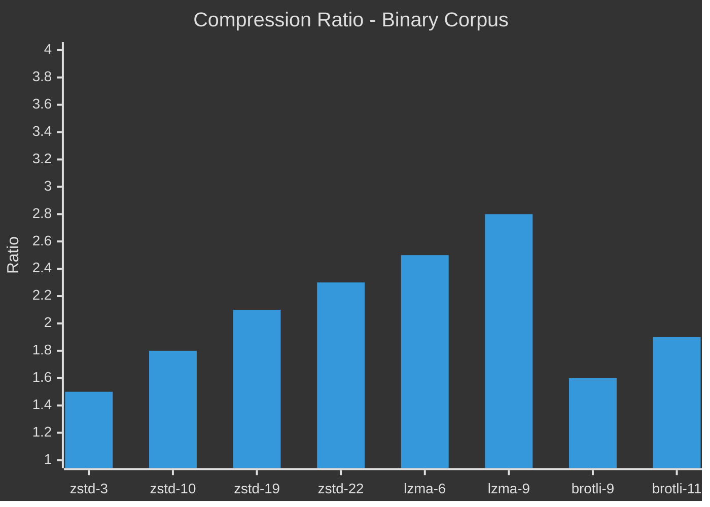
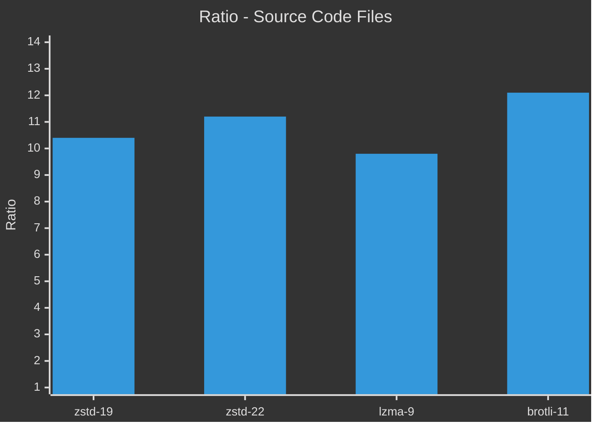
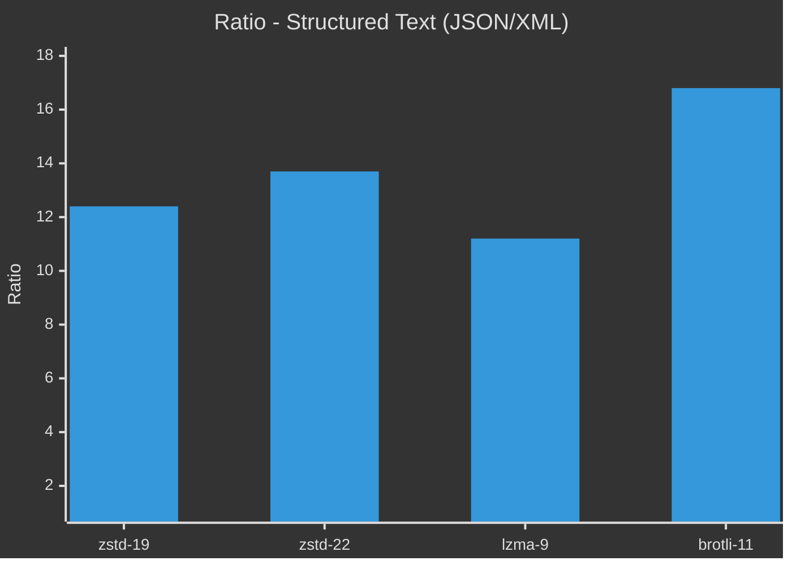
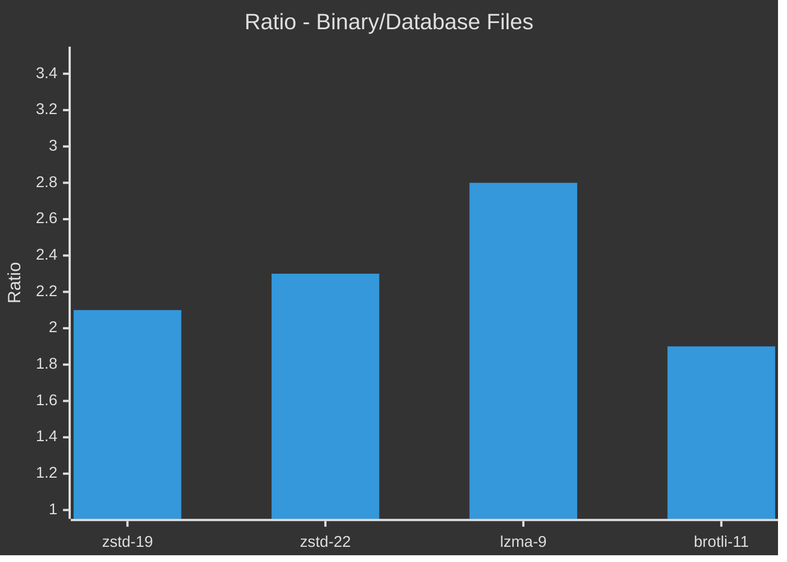

# Ratio by Algorithm

**Summary**: Grafici comparativi del compression ratio per algoritmo.

**Last updated**: 2026-04-22

---

## Text Corpus

### Tutti gli Algoritmi su Testo



**Osservazioni**:
- **brotli-11** ha il miglior ratio per testo (4.5x)
- **zstd-22** è competitivo (4.3x) ma più veloce
- **lzma-9** è leggermente inferiore su testo

### Encode Time vs Ratio



**Trade-off evidente**: zstd-22 dà 95% del ratio di brotli-11 in 1/8 del tempo.

---

## Binary Corpus

### Tutti gli Algoritmi su Binari



**Osservazioni**:
- **lzma-9** domina su binari (2.8x)
- **zstd-22** è secondario (2.3x)
- **brotli** è pessimo su binari (1.9x)

---

## By File Type

### Codice Sorgente (.cpp, .py, .js)



### JSON/XML



**brotli-11 eccelle su JSON**: 16.8x ratio!

### Database/Binari



**lzma-9 domina**: 2.8x vs 2.3x di zstd

---

## Summary Table

### Overall Rankings

| Rank | Algorithm | Best For | Avg Ratio |
|------|-----------|----------|-----------|
| 1 | **brotli-11** | Text, JSON, XML | 7.5x |
| 2 | **zstd-22** | General purpose | 5.2x |
| 3 | **lzma-9** | Binary, DB, logs | 4.6x |
| 4 | **zstd-19** | Balanced | 4.8x |

### Speed Rankings

| Rank | Algorithm | Context | Speed |
|------|-----------|---------|-------|
| 1 | zstd-3 | Real-time | Lightning |
| 2 | zstd-19 | Batch | Fast |
| 3 | zstd-22 | Cold storage | Medium |
| 4 | lzma-9 | Cold storage | Slow |
| 5 | brotli-11 | Cold storage | Very slow |

---

## Conclusioni

### Quando usare cosa?

```
File Type          → Algorithm    → Level
─────────────────────────────────────────
Text/JSON/XML      → brotli       → 11
Source code        → zstd         → 19-22
Binary/Database    → lzma         → 9 extreme
Mixed/Unknown      → zstd         → 19
Real-time          → zstd         → 3-5
```

---

## Related Pages

- [[methodology]] — Come generare questi dati
- [[../algorithms/comparison-matrix]] — Tabella completa
- [[../decisions/file-type-to-algorithm]] — Decision mapping