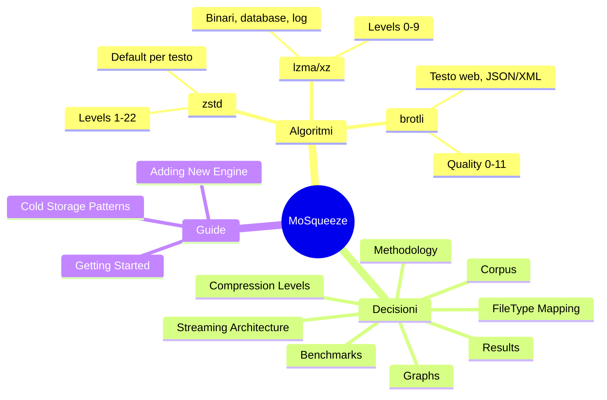

# MoSqueeze Wiki

**Summary**: Knowledge base per MoSqueeze - compressione cold storage data-driven.

**Last updated**: 2026-04-22

---

## Mappa Concettuale

---

## Sezioni Principali

### [[algorithms/]] — Deep Dive Algoritmi

Analisi dettagliata di ogni algoritmo di compressione supportato, con trade-off, best practices e casi d'uso.

- [[algorithms/zstd]] — Zstandard: default per la maggior parte dei file
- [[algorithms/lzma-xz]] — LZMA/XZ: ottimo per binari e database
- [[algorithms/brotli]] — Brotli: ottimizzato per testo web
- [[algorithms/comparison-matrix]] — Tabella comparativa completa

### [[decisions/]] — Decisioni Architetturali

ADR (Architecture Decision Records) per le scelte chiave del progetto.

- [[decisions/file-type-to-algorithm]] — Mappatura FileType → Engine raccomandato
- [[decisions/streaming-architecture]] — Perché streaming 64KB buffer
- [[decisions/compression-levels]] — Quando usare extremes vs defaults

### [[benchmarks/]] — Risultati Benchmark

Dati reali dalle esecuzioni del benchmark harness.

- [[benchmarks/methodology]] — Come eseguiamo i benchmark
- [[benchmarks/corpus-selection]] — Quali file testiamo e perché
- [[benchmarks/results/index]] — Storico risultati per data
- [[benchmarks/graphs/ratio-by-algorithm]] — Grafici comparativi

### [[guides/]] — Guide per Contributor

Documentazione operativa.

- [[guides/getting-started]] — Build, test, contribuire
- [[guides/adding-new-engine]] — Step-by-step per nuovo algoritmo
- [[guides/cold-storage-patterns]] — Best practices archiviazione

---

## Quick Reference

| Tipo File | Algoritmo | Livello | Note |
|-----------|-----------|---------|------|
| Codice sorgente | zstd o brotli | 19-22 | Alta compressione testo |
| JSON/XML | brotli | 11 | Ottimizzato web content |
| Log/Database | lzma | 9 | Pattern ripetitivi |
| PNG/GIF | zstd | 19 | Già compressi, ma migliorabili |
| JPEG/MP4 | SKIP | — | Ricomprimere peggiora |

---

## Quick Links

### Per Iniziare
1. [[guides/getting-started]] — Setup ambiente
2. [[algorithms/comparison-matrix]] — Quale algoritmo usare

### Per Sviluppare
1. [[guides/adding-new-engine]] — Aggiungere un algoritmo
2. [[decisions/streaming-architecture]] — Capire l'architettura

### Per Decidere
1. [[decisions/file-type-to-algorithm]] — FileType → Algoritmo
2. [[decisions/compression-levels]] — Livello di compressione

### Per Benchmarking
1. [[benchmarks/methodology]] — Metodologia
2. [[benchmarks/graphs/ratio-by-algorithm]] — Risultati visualizzati

---

## Collegamenti Esterni

- [Repository GitHub](https://github.com/fathorMB/MoSqueeze)
- [Issues](https://github.com/fathorMB/MoSqueeze/issues)

---

## Changelog

Vedi [[log]] per la cronologia completa delle modifiche al wiki.