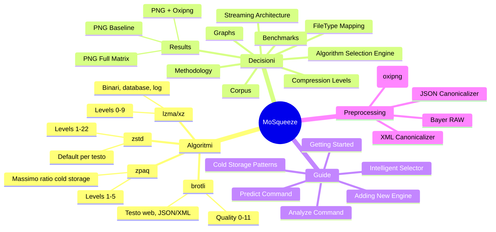

# MoSqueeze Wiki

**Summary**: Knowledge base per MoSqueeze - compressione cold storage data-driven.

**Last updated**: 2026-04-24

---

## Mappa Concettuale

---

## Sezioni Principali

### [[algorithms/]] - Deep Dive Algoritmi

Analisi dettagliata di ogni algoritmo di compressione supportato, con trade-off, best practices e casi d'uso.

- [[algorithms/zstd]] - Zstandard: default per la maggior parte dei file
- [[algorithms/lzma-xz]] - LZMA/XZ: ottimo per binari e database
- [[algorithms/brotli]] - Brotli: ottimizzato per testo web
- [[algorithms/zpaq]] - ZPAQ: massima compressione per cold storage estremo
- [[algorithms/video-compression]] - Strategia video cold storage (AVI/MKV con ZPAQ)
- [[algorithms/comparison-matrix]] - Tabella comparativa completa

### [[decisions/]] - Decisioni Architetturali

ADR (Architecture Decision Records) per le scelte chiave del progetto.

- [[decisions/file-type-to-algorithm]] - **Mappatura FileType -> Engine raccomandato** *(aggiornato 2026-04-23)*
- [[decisions/streaming-architecture]] - Perché streaming 64KB buffer
- [[decisions/compression-levels]] - Quando usare extremes vs defaults
- [[decisions/algorithm-selection-engine]] - Flusso selezione algoritmo e fallback

### [[benchmarks/]] - Risultati Benchmark

Dati reali dalle esecuzioni del benchmark harness.

- [[benchmarks/methodology]] - Come eseguiamo i benchmark
- [[benchmarks/corpus-selection]] - Quali file testiamo e perché
- [[benchmarks/results/index]] - **Storico risultati** *(aggiornato 2026-04-23)*

**PNG Benchmark Results** (1,445 files, 75K+ measurements):
- [PNG Full Matrix](../benchmarks/png-full-matrix-results.md) — Tutti i livelli testati
- [PNG + Oxipng](../benchmarks/png-oxipng-results.md) — Preprocessing oxipng

- [[benchmarks/graphs/ratio-by-algorithm]] - Grafici comparativi

### [[guides/]] - Guide per Contributor

Documentazione operativa.

- [[guides/getting-started]] - Build, test, contribuire
- [[guides/benchmark-tool]] - Enhanced `mosqueeze-bench` usage and options
- [[guides/benchmark-visualization]] - `mosqueeze-viz` dashboard/report generation
- [[guides/intelligent-selector]] - Intelligent recommendation engine (`mosqueeze suggest`)
- [[guides/predict-command]] - **Compression prediction** (`mosqueeze predict`) *(new 2026-04-24)*
- [[guides/grpc-service]] - Optional gRPC microservice (`mosqueeze-server`)
- [[guides/adding-new-engine]] - Step-by-step per nuovo algoritmo
- [[guides/cold-storage-patterns]] - Best practices archiviazione
- [[guides/analyze-command]] - Come usare `mosqueeze analyze`

### [[preprocessing]] - Reversible Preprocessing

Panoramica della pipeline di preprocessing lossless prima della compressione.

---

## Key Findings

### PNG Compression (2026-04-23)

| Config | Ratio | Time | Use Case |
|--------|-------|------|----------|
| ZSTD/19 (baseline) | 1.091x | 42ms | Fast |
| **Oxipng + ZSTD/22** | **1.120x** | 370ms | **Cold Storage** |
| BROTLI/1 | 1.057x | ~0ms | Instant |

**Insight**: PNG è comprimibile (~9-12%) — oxipng aggiunge +2.5%.

---

## Changelog

Vedi [[log]] per la cronologia completa delle modifiche al wiki.

- **2026-04-23**: Aggiunti risultati PNG baseline, full matrix, oxipng
- **2026-04-22**: Initial benchmark results
