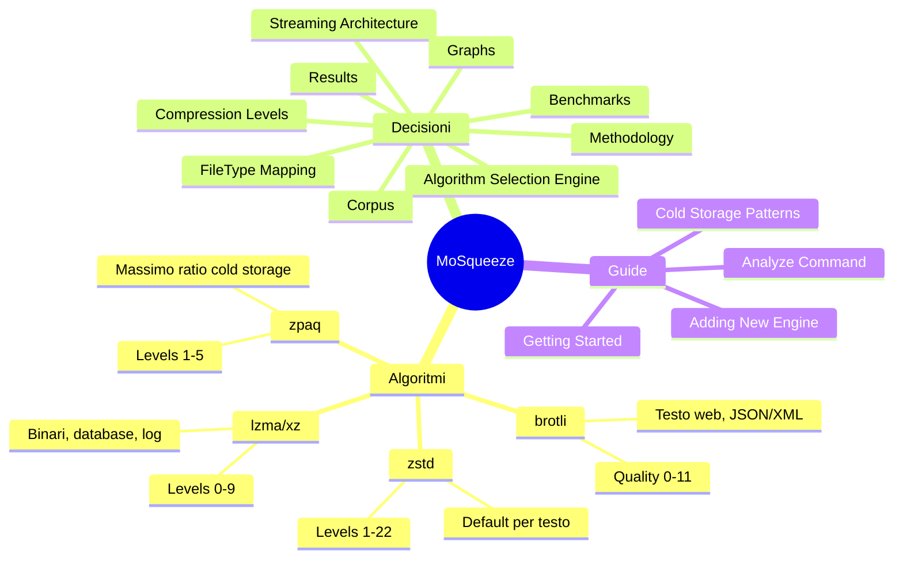

# MoSqueeze Wiki

**Summary**: Knowledge base per MoSqueeze - compressione cold storage data-driven.

**Last updated**: 2026-04-22

---

## Mappa Concettuale

---

## Sezioni Principali

### [[algorithms/]] - Deep Dive Algoritmi

Analisi dettagliata di ogni algoritmo di compressione supportato, con trade-off, best practices e casi d'uso.

- [[algorithms/zstd]] - Zstandard: default per la maggior parte dei file
- [[algorithms/lzma-xz]] - LZMA/XZ: ottimo per binari e database
- [[algorithms/brotli]] - Brotli: ottimizzato per testo web
- [[algorithms/zpaq]] - ZPAQ: massima compressione per cold storage estremo
- [[algorithms/video-compression]] - Strategia video cold storage (AVI/MKV con ZPAQ)
- [[algorithms/comparison-matrix]] - Tabella comparativa completa

### [[decisions/]] - Decisioni Architetturali

ADR (Architecture Decision Records) per le scelte chiave del progetto.

- [[decisions/file-type-to-algorithm]] - Mappatura FileType -> Engine raccomandato
- [[decisions/streaming-architecture]] - Perche streaming 64KB buffer
- [[decisions/compression-levels]] - Quando usare extremes vs defaults
- [[decisions/algorithm-selection-engine]] - Flusso selezione algoritmo e fallback

### [[benchmarks/]] - Risultati Benchmark

Dati reali dalle esecuzioni del benchmark harness.

- [[benchmarks/methodology]] - Come eseguiamo i benchmark
- [[benchmarks/corpus-selection]] - Quali file testiamo e perche
- [[benchmarks/results/index]] - Storico risultati per data
- [[benchmarks/graphs/ratio-by-algorithm]] - Grafici comparativi

### [[guides/]] - Guide per Contributor

Documentazione operativa.

- [[guides/getting-started]] - Build, test, contribuire
- [[guides/benchmark-tool]] - Enhanced `mosqueeze-bench` usage and options
- [[guides/adding-new-engine]] - Step-by-step per nuovo algoritmo
- [[guides/cold-storage-patterns]] - Best practices archiviazione
- [[guides/analyze-command]] - Come usare `mosqueeze analyze`

---

## Changelog

Vedi [[log]] per la cronologia completa delle modifiche al wiki.
